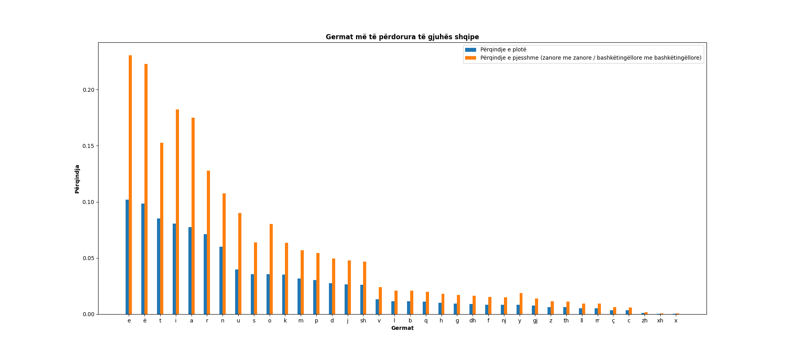
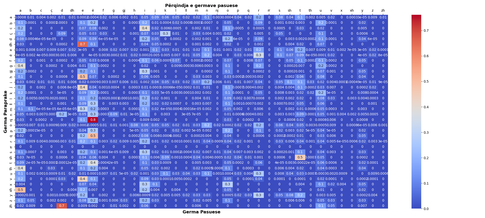

# Statistikë Gjuhësore

Synimi i këtij projekti është të nxjerr në pah elemente gjuhësore të alfabetit të gjuhës shqipe. Kodi i mësipërm llogarit këto të dhëna:
1. Përqindjen e shkronjave më të përdorura të gjuhës shqipe,
   1. Përqindjen e plotë - Numrin e shfaqjeve të një shkronjeje në korpusin e paraqitur.
   2. Përqindjen e pjesshme - Numrin e paraqitjeve të një zanoreje/bashkëtingëlloreje në krahasim me zanoret/bashkëtingëlloret e tjera në korpusin e dhënë.
2. Përqindjen e shkronjave pasuese, p.sh në fjalën `elemente` germat pasuese të `e-së` janë: `l, m, n`, secila nga një herë.
3. Alfabetin i ri - Zëvendësimi i shkronjave të përbëra me germa njëshkronjëshe:

```python
    SHRKONJAT_E_PËRBËRA = {
        "dh": "ð",
        "gj": "ɟ",
        "ll": "ɫ",
        "nj": "ɲ",
        "rr": "r̪",
        "sh": "ʃ",
        "th": "θ",
        "xh": "ҳ",  # "d͡ʒ", (NOT STANDART)
        "zh": "ʒ",
    }
```

4. Krahasimi i gjatësisë së teksteve me alfabete të ndryshme.


## Resultatet
Rezultatet bazohen në romanin `Gjakftohësia` të Ismail Kadaresë të cilin mund ta gjeni në skedarin e quajtur `text.txt`.

1. Përqindja e përdorimit të shkronjave


2. Përqindja e shkronjave pasuese


3. Teksti me alfabet të vjetër ka `679657` germa kurse ai me alfabet të ri `635567`.
4. Teksti me alfabet të ri është `6.49%` apo `44090` shkronja më i shkurtër.
5. Një fjalë ka mesatarisht `3.98` shkronja (përfshin lidhëzat).
6. Një fjali përmban rreth `21.67` fjalë. 
7. Përdorimi i alfabetit të ri do të rezultonte në `14.7` faqe më pak për veprën e analizuar.
